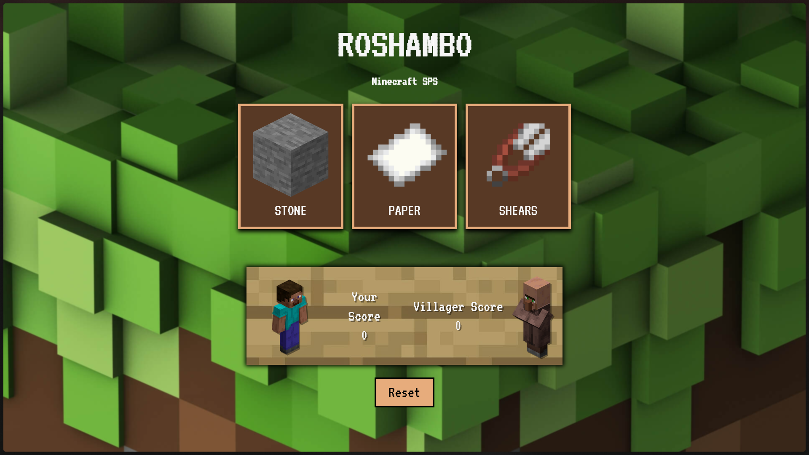

<h1 align="center">🎲 Roshambo</h1>

  A Minecraft theme lightweight Rock–Paper–Scissors game built with <b>HTML</b>, <b>CSS</b>, and <b>JavaScript</b>. 
  Just click, play, and watch who wins — no frameworks, no nonsense.

---

## 🕹️ How It Works

Click **Rock**, **Paper**, or **Scissors** — the computer makes a random move and the result shows up instantly.  
Built for fun and quick practice with DOM manipulation, styling, and logic.

## 💬 Notes

Just a small web project to practice the basics — no libraries, no build tools, just raw front-end code.

🪨 📄 ✂️

Made for fun, not perfection.

